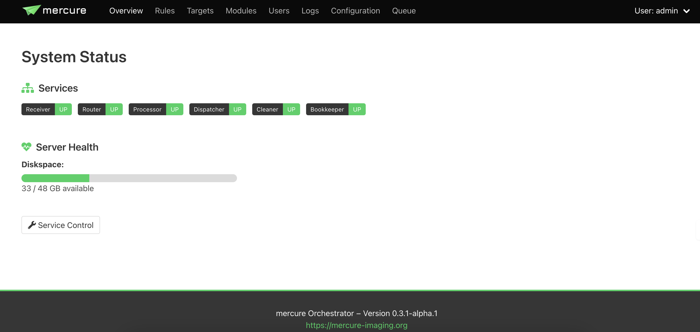
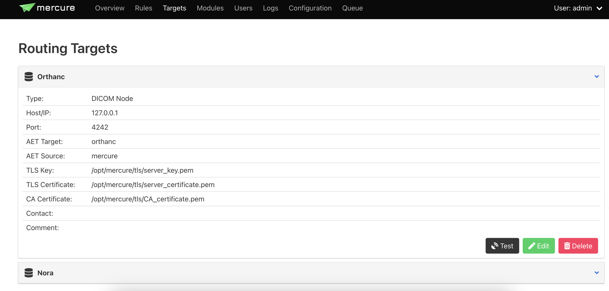

# Motion Correction (Mercure module) 
This software can be set up as a module on [Mercure](https://mercure-imaging.org/docs/#) DICOM router. It will take the fMRI images as input and apply an ANTs motion correction algorithm in 4D. 

### Docker:
``plasomicsi/mercure-motioncorr_nii:latest``

# Mercure Project Overview

Mercure is a robust web-based orchestration system designed to manage and monitor various services within a DICOM network. The application provides real-time insights into system status, server health, and service management, making it an essential tool for medical imaging and healthcare IT infrastructures.

## Features

- **Service Monitoring**: Continuously track the status of key components such as the Receiver, Router, Processor, Dispatcher, Cleaner, and Bookkeeper.
- **Server Health**: Overview of server resources including disk space usage to ensure smooth operation.
- **Configuration Management**: Manage settings and configurations directly from the web interface.
- **Security**: Integrated TLS support ensures that all data transmitted over the network is secure.

## Getting Started

To get started with Mercure, clone this repository (or download from Docker) and follow the setup instructions provided in the [official Mercure documentation](https://mercure-imaging.org/docs/#).

## GUI

### System Status

The main page displays the system status overview of the Mercure web application. It shows the operational status of various services and server health in terms of disk space availability.

### Routing Configuration

The server must be connected to the Orthanc server, where the processed images can be finally downloaded. It provides detailed configuration options for DICOM nodes, including TLS security settings.

## Contributions

Contributions are welcome! Please fork this repository and submit a pull request with your enhancements. For major changes, please open an issue first to discuss what you would like to change.

## License

This project is licensed under the MIT License - see the LICENSE.md file for details.
